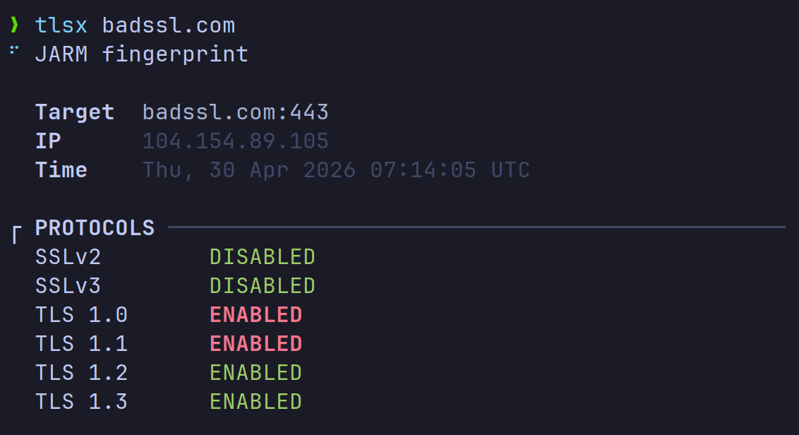
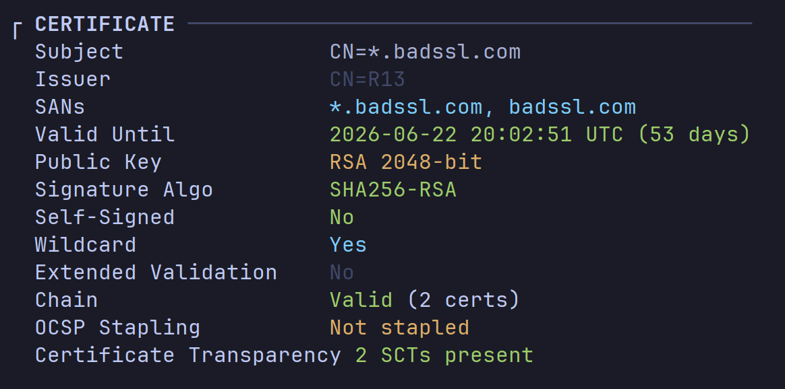
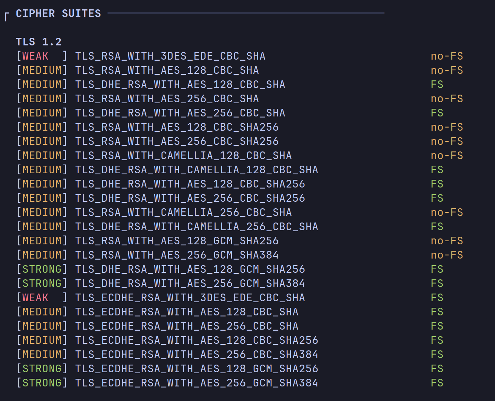
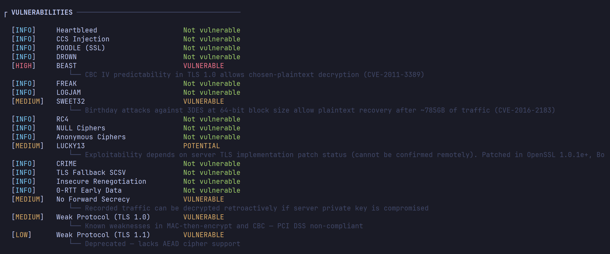
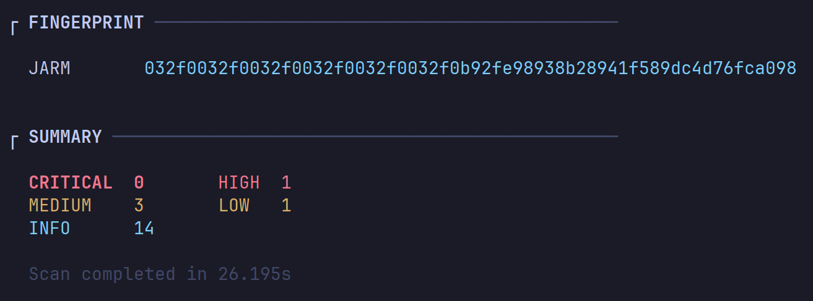
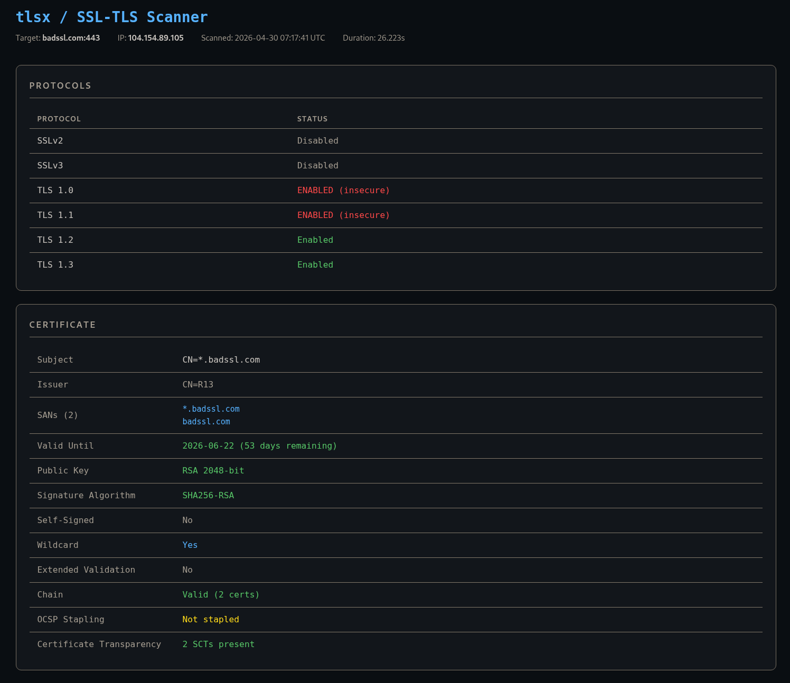

# tlsx

Fast TLS/SSL analyzer for offensive security assessments. Checks protocol support, cipher suites, certificate details, and common vulnerabilities all in one run.

## Installation

Download the latest binary from the [Releases](../../releases) page and drop it somewhere in your PATH.

```bash
chmod +x tlsx
sudo mv tlsx /usr/local/bin/
```

---

## Usage

```bash
tlsx <target> [flags]
```

```bash
tlsx example.com
tlsx example.com:8443
tlsx example.com -o report.txt --html report.html
tlsx mail.example.com --starttls smtp
tlsx example.com --delay 500 --timeout 20
```

### Flags

```
-p, --port      int     Target port (default: 443)
--starttls      string  STARTTLS protocol: smtp|imap|pop3|ftp|xmpp|ldap
--timeout       int     Connection timeout in seconds (default: 10)
--delay         int     Delay between checks in ms (default: 0)
--no-color              Disable color output
-o, --output    string  Save output to TXT file
--html          string  Save output to HTML report
-h, --help              Show help
```

---

## What it checks

**Protocols** : SSLv2, SSLv3, TLS 1.0 through TLS 1.3. Uses a Chrome 120 ClientHello fingerprint for TLS 1.2/1.3 to avoid getting blocked by WAFs and CDNs that filter based on TLS fingerprint (Imperva, Cloudflare, etc.).



**Certificate** : expiry, chain validation, SANs, key type and size, self-signed detection, OCSP stapling, CT logs.



**Cipher suites** : full enumeration per protocol version, rated INSECURE / WEAK / MEDIUM / STRONG, with forward secrecy flag.



**Vulnerabilities** : Heartbleed, BEAST, POODLE, DROWN, FREAK, LOGJAM, SWEET32, RC4, CCS Injection, CRIME, NULL/anonymous ciphers, insecure renegotiation, 0-RTT, missing forward secrecy, and deprecated protocol versions.



**JARM fingerprint** : identifies the server TLS stack.



---

## Reports

Plain text and HTML output are supported. The HTML report is a single self-contained file, useful for including in pentest deliverables.

```bash
tlsx example.com -o report.txt --html report.html
```



---

## Notes

- If TLS fails completely but the host redirects to a different hostname via HTTP, tlsx detects it and automatically re-scans the real target.
- Use `--delay` when scanning targets with rate limiting or IDS in place.
- `--starttls` supports smtp, imap, pop3, ftp, xmpp and ldap.
